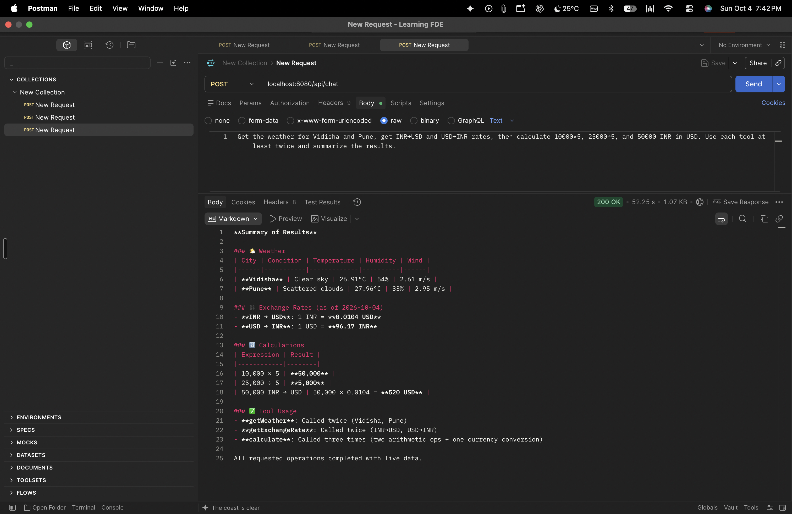

# 🤖 Spring AI Website Builder Agent

An AI-powered agent built with **Java, Spring Boot, Spring AI, and OpenRouter** that uses LLM tool calling to understand natural-language requests and perform actions through custom tools.

The project started as a **Tomato customer-support chatbot** and evolved into a practical **AI Agent / Tool Calling project**, demonstrating how an LLM can use external tools to perform calculations, retrieve information, and create website files.

---

## 📸 Project Screenshots

### Tomato Support Chatbot


### Tool Calling — Postman



> The screenshots demonstrate the application UI and successful tool-calling results. The generated website image is intentionally not included.

---

## 🚀 What This Project Demonstrates

A normal LLM can understand a request and generate text, but it cannot directly interact with external systems.

This project adds **tools** to the LLM so that it can take controlled actions.

```text
User Request
      ↓
     LLM
      ↓
Choose required tool
      ↓
Tool Execution
      ↓
Tool Result
      ↓
     LLM
      ↓
Final Response
```

The project demonstrates the transition from:

```text
Chatbot
   ↓
LLM + Tools
   ↓
Tool Calling
   ↓
AI Agent
   ↓
Agent that can take actions
```

---

## ✨ Features

### 💬 AI Chat

A Spring AI powered chatbot that understands natural-language requests and generates contextual responses.

### 🔧 Tool Calling

The agent can automatically select and execute tools based on the user's request.

Implemented tools include:

- 🧮 Calculator
- 🌤️ Weather lookup
- 💱 Currency conversion
- 📁 Directory creation
- ✍️ File writing
- 📖 File reading
- 📂 File listing

### 🧮 Calculator Tool

Allows the LLM to perform calculations using a dedicated tool instead of relying on the model to calculate the result itself.

Example:

```text
Calculate 25000 × 5
```

### 🌤️ Weather Tool

Retrieves weather information for requested locations.

Example:

```text
What's the weather in Pune?
```

### 💱 Currency Conversion Tool

Supports currency exchange operations.

Example:

```text
Convert 10000 INR to USD
```

### 🌐 Website Builder Agent

The main agent capability is an AI-powered website builder.

A user can provide a natural-language requirement such as:

```text
Create a modern landing page for a coffee shop called BrewLab.
Use a dark theme with a hero section, menu section and contact section.
```

The agent can:

1. Understand the requirement
2. Decide which tools are required
3. Create the project directory
4. Generate HTML
5. Generate CSS
6. Generate JavaScript
7. Write the files into the workspace
8. Read existing files when required
9. Inspect the generated project

Generated projects are stored inside:

```text
generated-sites/
```

Example:

```text
generated-sites/
└── brewlab/
    ├── index.html
    ├── style.css
    └── script.js
```

---

## 🏗️ Architecture

```text
                         ┌──────────────────┐
                         │      User        │
                         └────────┬─────────┘
                                  │
                                  ▼
                         ┌──────────────────┐
                         │  Spring Boot API │
                         └────────┬─────────┘
                                  │
                                  ▼
                         ┌──────────────────┐
                         │    Spring AI     │
                         │    ChatClient    │
                         └────────┬─────────┘
                                  │
                                  ▼
                         ┌──────────────────┐
                         │    OpenRouter    │
                         │       LLM        │
                         └────────┬─────────┘
                                  │
                           Tool Calling
                                  │
             ┌────────────────────┼────────────────────┐
             │                    │                    │
             ▼                    ▼                    ▼
       Calculator             Weather            Currency
          Tool                  Tool                Tool
             │                    │                    │
             └────────────────────┼────────────────────┘
                                  │
                                  ▼
                         ┌──────────────────┐
                         │  Website Tools   │
                         ├──────────────────┤
                         │ createDirectory  │
                         │ writeFile        │
                         │ readFile         │
                         │ listFiles        │
                         └────────┬─────────┘
                                  │
                                  ▼
                         generated-sites/
```

---

## 🛠️ Tech Stack

| Technology | Purpose |
|---|---|
| Java 25 | Programming language |
| Spring Boot 4.1.1 | Backend framework |
| Spring AI 2.0.0 | AI integration and tool calling |
| OpenRouter | LLM API gateway |
| Maven | Dependency management |
| HTML | Frontend structure |
| CSS | Frontend styling |
| JavaScript | Frontend interaction |
| Git & GitHub | Version control |

---

## 📁 Project Structure

```text
FDE/
├── .gitignore
├── README.md
├── pom.xml
│
├── generated-sites/
│
├── screenshots/
│   ├── postman-results.png
│   └── tomato-support.png
│
└── src/
    └── main/
        ├── java/
        │   └── org/
        │       └── example/
        │           ├── Main.java
        │           ├── SummarizeController.java
        │           ├── SummarizeService.java
        │           ├── WebsiteBuilderController.java
        │           ├── WebsiteBuilderService.java
        │           │
        │           └── aiTools/
        │               ├── CalculatorTool.java
        │               ├── CurrencyExchangeTool.java
        │               ├── WeatherTool.java
        │               └── WebsiteTools.java
        │
        └── resources/
            ├── static/
            │   ├── index.html
            │   ├── style.css
            │   └── script.js
            │
            └── application.properties
```

---

## 🔌 API Endpoints

### Chat

```http
POST /api/chat
```

Example request:

```text
What is the weather in Pune?
```

---

### Website Builder

```http
POST /website
```

Example request:

```text
Create a modern responsive website for a coffee shop called BrewLab.
Use a dark theme with a hero section, menu section and contact section.
```

The agent processes the request and uses the available website tools to create the required files.

---

## ⚙️ Getting Started

### 1. Clone the repository

```bash
git clone https://github.com/<your-username>/spring-ai-website-builder-agent.git
cd spring-ai-website-builder-agent
```

### 2. Configure OpenRouter

Set your OpenRouter API key as an environment variable.

macOS / Linux:

```bash
export OPENROUTER_API_KEY="your-api-key"
```

Windows PowerShell:

```powershell
$env:OPENROUTER_API_KEY="your-api-key"
```

The application expects:

```properties
spring.application.name=FDE

spring.ai.openai.base-url=https://openrouter.ai/api/v1
spring.ai.openai.api-key=${OPENROUTER_API_KEY}

spring.ai.openai.chat.options.model=openrouter/free
```

**Never commit your actual API key to GitHub.**

---

## ▶️ Run the Application

Using Maven:

```bash
./mvnw spring-boot:run
```

Or run the Spring Boot application from IntelliJ IDEA.

The application starts at:

```text
http://localhost:8080
```

Open:

```text
http://localhost:8080
```

---

## 🧪 Testing Tool Calling

The agent can handle requests that require multiple tools.

Example:

```text
Get the weather for Vidisha and Pune,
get INR to USD and USD to INR exchange rates,
then calculate 10000 × 5, 25000 × 5 and 50000 × 5.
Use each tool multiple times and summarize the results.
```

The LLM determines which tools are required, executes them, receives the results, and generates the final response.

---

## 🔐 Security

The Website Builder uses a dedicated workspace for generated files:

```text
generated-sites/
```

File paths should be normalized and validated before filesystem operations are performed.

This prevents the agent from accessing arbitrary locations outside the intended workspace.

The project demonstrates an important AI-agent security principle:

```text
LLM
 ↓
Tool
 ↓
Validation
 ↓
Allowed Resource
```

AI agents should never receive unrestricted filesystem or system access.

---

## 🧠 AI Agent Concepts

This project was built to understand AI Agents from first principles.

### LLM

```text
Understand
   ↓
Reason
   ↓
Generate
```

### AI Agent

```text
Goal
 ↓
Decide
 ↓
Act
 ↓
Observe
 ↓
Decide Again
```

Concepts demonstrated:

- LLM tool calling
- Function calling
- Tool selection
- Multiple tool calls
- Tool results
- Agent loops
- Information tools
- Action tools
- File-system tools
- Workspace sandboxing
- Path traversal protection
- Agent security
- Natural language → structured actions

---

## 📚 Key Learnings

Through this project I explored:

- How Spring AI integrates with LLM providers
- How tool/function calling works
- How an LLM decides which tool to use
- How tools return information to an LLM
- How multiple tools can be executed for one request
- How AI agents differ from traditional workflows
- How AI agents interact with external systems
- How filesystem tools can be exposed safely
- Why sandboxing is important for AI agents
- How natural-language requirements can be converted into executable actions

---

## 🚧 Future Improvements

- [ ] Persistent conversation memory
- [ ] Conversation/session IDs
- [ ] Human-in-the-loop approval
- [ ] Tool permission management
- [ ] Website preview
- [ ] ZIP export for generated websites
- [ ] GitHub repository generation
- [ ] Automated website validation
- [ ] Unit and integration tests
- [ ] Docker support
- [ ] Production-ready logging and monitoring
- [ ] Authentication and authorization
- [ ] Database-backed agent sessions

---

## 🎯 Project Goal

The goal of this project is to understand how modern **AI Agents** can be designed and implemented using Java and Spring AI.

Instead of building only a chatbot, the project focuses on the transition from:

```text
Chatbot
   ↓
LLM + Tools
   ↓
Tool Calling
   ↓
AI Agent
   ↓
Agent that can take actions
```

---

## 👨‍💻 Author

**Kunj**

Java | Spring Boot | AI Agents | Full Stack Development

---

## 📄 License

This project is built for learning and portfolio purposes.
