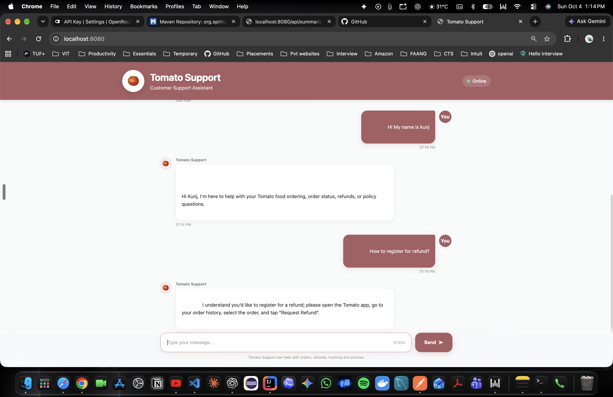

# 🍅 Tomato Support — AI Customer Support Assistant

An AI-powered customer support assistant for **Tomato**, a food delivery application. Built with **Java, Spring Boot, Spring AI, and OpenRouter**, with a responsive HTML/CSS/JavaScript chat interface.

## 📸 Application Preview



## ✨ Features

- 🤖 AI-powered customer support using Spring AI
- 🍅 Responsive Tomato-themed chat interface
- 💬 Conversational customer support
- 📦 Food ordering and order-related assistance
- 💰 Refund and cancellation assistance
- 🚚 Order tracking and delivery-status queries
- 📋 Tomato policy-related assistance
- 🛡️ Restricts unrelated queries
- 💡 Empathetic responses for frustrated customers
- 🔐 API key managed through environment variables
- 📱 Responsive desktop, tablet, and mobile UI

## 🏗️ Tech Stack

| Layer | Technology |
|---|---|
| Backend | Java, Spring Boot |
| AI Integration | Spring AI |
| LLM Provider | OpenRouter |
| Frontend | HTML, CSS, JavaScript |
| Build Tool | Maven |
| API | REST |
| Version Control | Git & GitHub |

## 🧠 Architecture

```text
User
  │
  ▼
Tomato Support Web UI
  │
  │ POST /api/chat
  ▼
Spring Boot REST Controller
  │
  ▼
SummarizeService
  │
  │ System Prompt + Conversation History
  ▼
Spring AI ChatClient
  │
  ▼
OpenRouter
  │
  ▼
AI Model
  │
  ▼
Customer Support Response
```

## 🔑 Environment Configuration

The OpenRouter API key is **not stored in the source code**.

`application.properties` uses an environment variable:

```properties
spring.application.name=FDE
spring.ai.openai.base-url=https://openrouter.ai/api/v1
spring.ai.openai.api-key=${OPENROUTER_API_KEY}
spring.ai.openai.chat.options.model=openrouter/free
```

Set the API key before starting the application.

### macOS / Linux

```bash
export OPENROUTER_API_KEY="YOUR_OPENROUTER_API_KEY"
```

Or configure `OPENROUTER_API_KEY` in the IntelliJ IDEA Run Configuration.

> Never commit your actual API key to GitHub.

## 🚀 Getting Started

### 1. Clone the repository

```bash
git clone https://github.com/KunjMaheshwari/Customer-Support-Assistant.git
cd Customer-Support-Assistant
```

### 2. Configure the API key

Set:

```text
OPENROUTER_API_KEY=YOUR_OPENROUTER_API_KEY
```

### 3. Run the application

Using Maven:

```bash
./mvnw spring-boot:run
```

Or run the `Main` class from IntelliJ IDEA.

### 4. Open the application

Visit:

```text
http://localhost:8080
```

The frontend is served by Spring Boot from:

```text
src/main/resources/static/
```

## 🔌 API

### Chat

**Endpoint**

```http
POST /api/chat
```

**Request**

```http
Content-Type: text/plain
```

Example:

```text
How can I request a refund?
```

**Response**

```text
I understand you'd like to request a refund...
```

## 🎯 Supported Queries

The assistant is designed to handle:

- Food ordering
- Order status
- Delivery tracking
- Refunds
- Cancellations
- Delivery issues
- Tomato policies

For unrelated questions, it responds with:

> I'm sorry, I can only assist with Tomato's food ordering, order, refund, tracking, and policy-related queries.

## 🔒 Security

- API credentials are supplied through environment variables.
- Secrets are excluded from version control.
- `.env` files are ignored through `.gitignore`.
- API keys should never be committed to the repository.

## 📂 Project Structure

```text
Customer-Support-Assistant/
├── .gitignore
├── README.md
├── pom.xml
└── src/
    └── main/
        ├── java/
        │   └── org/example/
        │       ├── Main.java
        │       ├── SummarizeController.java
        │       └── SummarizeService.java
        └── resources/
            ├── application.properties
            └── static/
                ├── index.html
                ├── style.css
                └── script.js
```

## 🔮 Future Improvements

- Persistent conversation history per user/session
- Database-backed chat history
- Authentication and user accounts
- Order-management API integration
- Real-time order tracking
- RAG for Tomato policies
- Vector database for semantic search
- Streaming AI responses
- Automated unit and integration tests
- Docker deployment
- Cloud deployment

## 👨‍💻 Author

**Kunj Maheshwari**

GitHub: [KunjMaheshwari](https://github.com/KunjMaheshwari)

---

⭐ If you found this project interesting, consider giving the repository a star!
